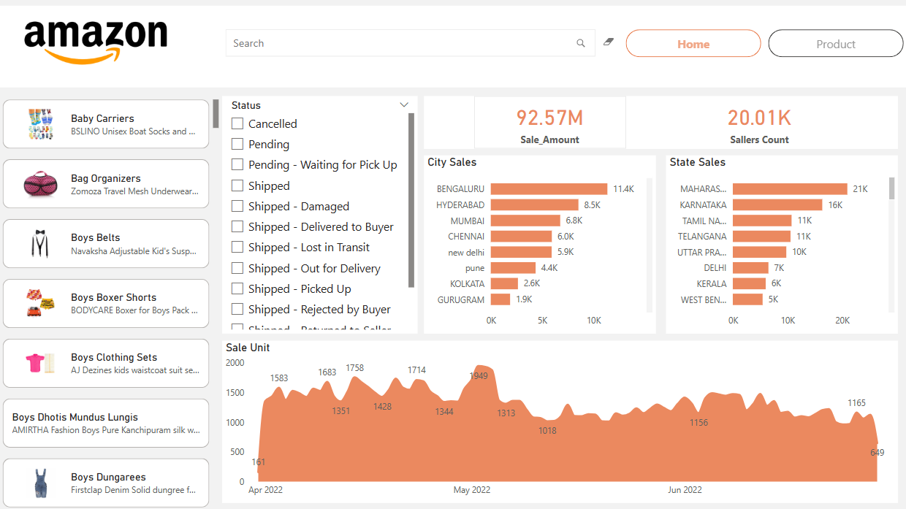
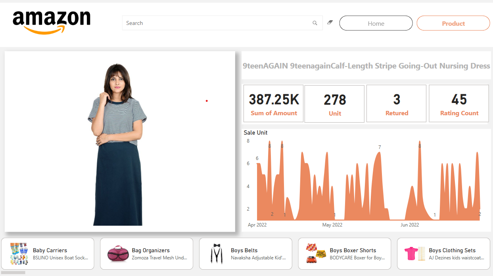

# Amazon Sales Dashboard

This project involves the creation of an interactive Amazon Sales Dashboard using Power BI to analyze and visualize sales performance, seller distribution, and product metrics for an Amazon e-commerce dataset.

**Top Performing Regions:**
- Bengaluru is the top city for sales (11.4K), indicating a high demand in this region.
- Maharashtra has the largest seller base (21K), making it a hub for Amazon sellers.

**Sales Trends:**
- Sales peaked in May 2022 (1949 units), possibly due to seasonal demand or promotional events.
- A noticeable dip in sales occurred in early June 2022 (1018 units), followed by a gradual recovery.

**Product Performance:**
- The "9teenAGAIN Nursing Dress" has a decent sales amount (387.25K) with 278 units sold, but a low return rate (3 returns) and 45 ratings, indicating good customer satisfaction.

**Order Management:**
- The status filter allows users to identify orders stuck in stages like "Pending" or "Out for Delivery," helping to improve logistics and customer satisfaction.

====================================================================================================================================================================================================================================================================================

